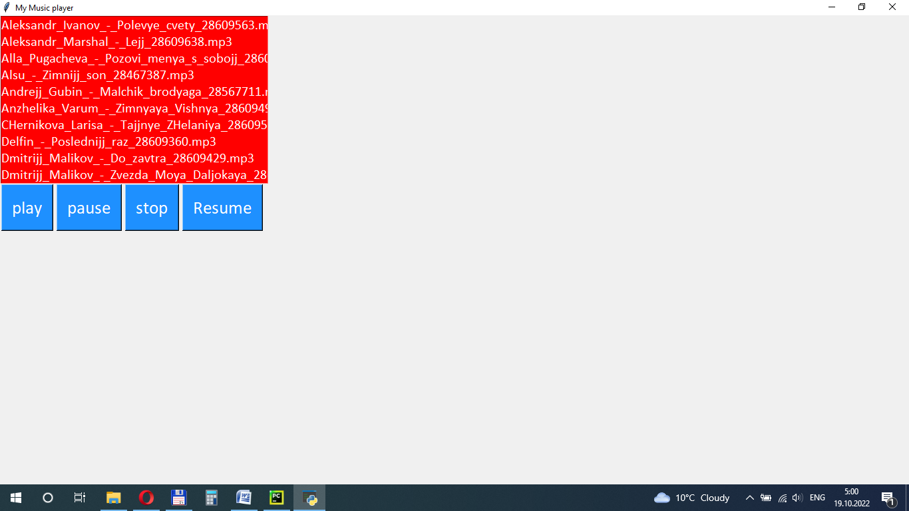

# My MP3 player
___

___
## about project
Welcome to my first project. As you have already noticed,
my project is small, therefore you don’t need a lot of
mind to use it. One window and several buttons.
For me, as a beginner python developer, creating my first
project was not easy.

___
## Used libraries
### from pygame import mixer 
Pygame module for loading and playing sounds This module contains
classes for loading Sound objects and controlling playback.
The mixer module is optional and depends on SDL_mixer. 
Your program must test it is available and initialized before using it.

### from tkinter import * 
Tkinter is a package of Python modules for building GUI applications.
Tkinter is used by default in Python.

### import os
it is a library of functions for working with the operating system.
The methods included in it allow you to determine the type of
operating system, access environment variables, manage directories nd files

___
## Installation
**pip** install __pygame__

link to install pygame module
https://www.youtube.com/watch?v=evjpa3v22-U
___
## total
I am very happy that my first project is working for me.
My project may seem weak to professionals, but for me it is a victory.

___THANKS___
:wink:
